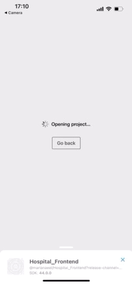

# Hospital-Management
This repository is designed to handle real-time hospital data service.
It includes a database management system and a set of API to handle it.
The project has been deployed on Amazon EC2 server, with Flask APP and MongoDB running seperately.
Now pushed to EC2 server http://34.238.84.218:8000/
**THERE IS STILL NOT A STABLE VERSION OF THIS SYSTEM, IF YOU ARE STILL INTERESTED PLEASE CHECK DEV BRANCH**

## Content
- [Hospital-Management](#hospital-management)
  - [Content](#content)
  - [Version 0.0.7](#version-007)
  - [Structure](#structure)
  - [Setup](#setup)
    - [Requirement](#requirement)
  - [How to use](#how-to-use)
  - [Query Syntax](#query-syntax)
  - [Flask API server](#flask-api-server)
    - [Flask API Class](#flask-api-class)
  - [MongoDB Database](#mongodb-database)
    - [Data Fields](#data-fields)
  - [User Stories](#user-stories)
  - [Branching Strategy](#branching-strategy)
  - [Unit Test](#unit-test)

## Version 0.0.7
Updated The Frontend of this project. Implemented a all platform frontend based on React Native.

## Structure
This system is constructed in three parts: Flask API server, MongoDB database and React-Native & Web intrance of the system.

[Flask API server](#flask-api-server)

[MongoDB Database](#mongodb-database)

[React Native Frontend](https://github.com/MarianaEel/Hospital-Frontend)


## Setup
### Requirement
```python
Python 3.8.12
Flask 2.0.2
Werkzeug 2.0.3
pandas 1.4.0
requests 2.27.1
pymongo 4.0.2
SpeechRecognition 3.8.1
google-api-python-client 2.42.0
```
- Check [requirements.txt](requirements.txt)

## How to use
- Local
  - Run hospital.db first, then post request to http://127.0.0.1:5000/CollectionName (if local), or use test_api to check if the local server is running correctly (make sure test_api.py is set to local mode).
- Remote 
  - Post request to http://34.238.84.218:8000/"CollectionName" (my server), or use test_api to check if the local server is running correctly.
- Use mobile app:
  - Download Expo and run https://expo.dev/@marianaeel/Hospital_Frontend.
  - 

## Query Syntax
- GET
  - Directly access `site_url = http://34.238.84.218:8000/CollectionName` is considered as get command and will return the whole collection as json file. 
  - Get method in python request package can also perform the get query.
  - Example code: 
    ```python
    request.get(site_url)
    ```
- POST
  - Post method in python request package can post data. 
  - Example code: 
    ``` python
    requests.post(site_url, postdata)
    ```
- PUT
  - Put method in python request package can put data.
  - Example code:
    ``` python
    request.put(site_url, putdata)
    ```
- DELETE
  - Use requests.request('DELETE', delete_url) to apply the delete.
    Where the delete_url is made of [site_url + "?id="Your_ID"]
  - Example code:
    ``` python
    request.request('DELETE', site_url + "?id="Your_ID")
    ```

## Flask API server
The API server use Flask_Restful framework and is defined in [hospital_db.py](hospital_db.py), it use json file to auto generate API class and API queries. Check how API class is construct: [Modules](/module/)

The API server is deployed on AWS EC2 server with open ports for access.

The API server is connected with deployed MongoDB using private port connection.

### Flask API Class

The Flask API class is automatically generate using factory module. The diagram of the structure is as following:


Check [factory module](/module/user_management/management_factory.py) for how to produce different Flask API class.

Check [prototype class](/module/user_management/management_api.py) for how the prototype and interface is defined.

## MongoDB Database
This project use MongoDB as database.
An API for MongoDB is implemented to control MongoDB queries, check [mongo_api.py](module/database_api/mongo_api.py) for more information.

The database is running seperately on server with only connection to the flask api server can only be accessed by the flask api server.

### Data Fields
Check the ERD:  Hospital DB:  


## User Stories
- Patient:
  - upload basic info
  - check test data of themselves
    - data
    - staff in charge
    - time
    - date
    - device info
  - check where to do the test
- Staff
  - know which patient to treat
  - check test datas of their patient
    - medical history (previous data)
    - patient info
    - time
    - date
    - device info
- Device company
  - interface to inject data from device
- Admin
  - add user
  - change user catagories
    - patient
    - staff
      - doctor
      - nurse
      - title
    - admin


## Branching Strategy
- Main:     A stable release of the system.
- Dev:      A in-developing version of system, unstable. Will bidirectionally integrated with main.
- Hotfix    A of emergency bug fixes. 


## Unit Test
This project use bottom-up unit test method. The unit test is designed to test all function in the module. Unit test can be found at test_api.py.

